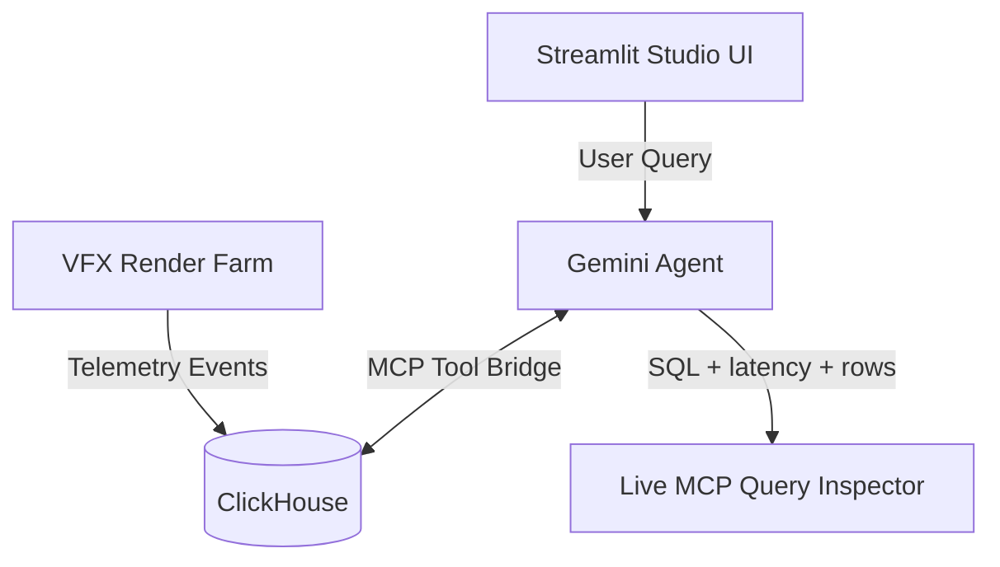

# 🎬 CineCompute AI

**A render farm loses money quietly.** A frame dies at 78 GB of VRAM, the scheduler retries
it, and the cost is gone before anyone reads a log. Across 250,000 events, nobody has time
to add it up.

CineCompute AI answers one question: **where is the render budget going, and what should
the pipeline TD change today?**

> **$65,999** of the **$97,885** wasted on renders that produced no frame is recoverable,
> and it traces to just two systemic faults: Houdini Karma hitting the 80 GB VRAM ceiling
> on `SEQ_010_SPACE_BATTLE` ($10,079), and an L40S pool crashing on `SEQ_045_UNDERWATER`
> ($55,919).

Ask it anything and it writes its own SQL — no pre-written queries. It inspects the schema,
queries, reads the result, queries again, and answers: why it happens, what it costs, what
to do. Every statement it writes is shown live, with its latency.

**Live demo → https://cinecompute-ai.streamlit.app**

*Google Cloud Agentic Cinema hackathon — ClickHouse partner track.*

## How the agent reaches the data

```
Streamlit UI  ──►  Gemini (google-genai, manual tool loop)
                        │  tools/list, tools/call   (MCP, stdio)
                        ▼
                 mcp-clickhouse 0.6  ──►  ClickHouse Cloud
```

The agent has no database driver of its own. `app/agent/mcp_client.py` launches the official
server as a subprocess, calls `initialize`, discovers the tools it publishes with `tools/list`
(`list_databases`, `list_tables`, `run_query`), and every statement the model writes goes out
as a `tools/call`. Writes are refused twice: the server opens ClickHouse with `readonly=1`,
and a statement allowlist rejects anything that is not a read before it leaves the client.

The dashboard figures at the top of the page are read with `clickhouse-connect` directly —
that path has no model in it; everything the agent does goes through MCP.

## Architecture



## What it does

- **Writes its own SQL.** No pre-written queries: it inspects the schema, queries,
  reads the result, queries again. Every statement appears live with its latency,
  and one button runs a question that is never cached.
- **Checks its own arithmetic.** A second agent re-derives every figure from the
  database. It never sees the value it is checking, and the comparison is
  arithmetic - no model decides whether a number is right.
- **Reads the calendar.** Two sequences have already spent their budget with 38 and
  55 days left before delivery; the one that looks healthy on money has four days
  of runway for 85 days of calendar.
- **Forecasts the landing point.** `frames_rendered` against `target_frames` gives a
  completion ratio, and all spend over frames delivered gives a cost per frame. The farm
  is 71.5% delivered for $387,998, so it lands near **$546,315 — $205,248 over the
  combined budgets** if the cost per frame does not change. SEQ_010 alone: 58% of its
  frames for 100% of its budget, landing at $207,692 against $74,686.
- **Puts a name on the waste, carefully.** `artist_id` makes failures traceable. The agent
  is required to compute the artist's failure rate *and* the farm's before naming anyone,
  because a busy artist fails more often simply by submitting more — then drafts a short,
  factual note offering help with the scene.
- **Sweeps unprompted, and exports the fix.** One click ranks every project x
  sequence x software x GPU slice - 12 systemic incidents, $57,836 recoverable -
  and writes them out as scheduler rules a render manager can apply.
- **Read-only by construction.** The MCP server opens ClickHouse with `readonly=1`,
  and a client-side allowlist rejects non-reads before they are sent.

## Data model

`cinecompute.vfx_render_events` (250,000 rows)

| column | type | notes |
|---|---|---|
| event_time | DateTime | last 30 days |
| project_id / sequence_id / shot_id | String | 3 projects × 3 sequences |
| software | String | Houdini_Karma, Maya_Arnold, Nuke_Comp, Blender_Cycles |
| gpu_model | String | A100_80GB, H100 (80 GB), L40S (48 GB), RTX4090 (24 GB) |
| vram_peak_gb | Float32 | always within the card's physical capacity |
| compute_duration_sec | UInt32 | |
| cost_usd | Float32 | |
| status | String | SUCCESS, OOM_KILLED, TIMEOUT, DRIVER_CRASH |
| error_details | String | |
| artist_id | String | 12 artists; who submitted the job |
| frames_rendered | UInt16 | frames the task delivered — always 0 unless SUCCESS |

`cinecompute.production_budgets` — `sequence_id`, `allocated_budget_usd`, `deadline`, `target_frames`.

Three anomalies are engineered into the data:
1. **DUNE_CH3 / SEQ_010_SPACE_BATTLE / Houdini_Karma** — ~48% `OOM_KILLED`, peaking above 78 GB on 80 GB cards.
2. **SEQ_045_UNDERWATER on NVIDIA_L40S** — 60% `DRIVER_CRASH` with 3.2× runtime overhead.
3. **artist_fx_07** — owns 82% of DUNE_CH3's memory kills, a 30.4% failure rate against a
   15.8% farm average. Implemented as attribution over failures the generator had already
   produced, so no count or cost changes.

`artist_id` and `frames_rendered` are drawn from a separate random stream
(`AUX_SEED`), never from the main one, so every figure published before they
existed is unchanged. `seed_vfx_data.py` asserts those figures after each re-seed
and fails the run if one has moved.

Budgets are calibrated against the generated spend so SEQ_010 lands ~61% over, SEQ_045 ~14% over, and SEQ_080 ~13% under — regardless of the RNG.

## Setup

### 1. Environment
```bash
cp .env.example .env
# set GEMINI_API_KEY and your ClickHouse credentials
```

### 2. Local run (Python 3.10+ — `mcp` requires it)
```bash
python3.12 -m venv .venv && source .venv/bin/activate
pip install -r requirements.txt
python scripts/seed_vfx_data.py      # creates tables + 250k rows, then verifies
python scripts/health_check.py       # preflight: ClickHouse, MCP tools, Gemini
streamlit run app/ui/app.py
```

### 3. Docker Compose (app + local ClickHouse)
```bash
docker compose up -d --build
docker compose exec app python scripts/seed_vfx_data.py
# UI at http://localhost:8080
```

## Putting the demo online

The app is a stateless Streamlit process; the only external dependencies are a
reachable ClickHouse and a Gemini API key. Two hosting paths:

### Option A — Streamlit Community Cloud (fastest, free)
1. Push this repo to GitHub.
2. On share.streamlit.io, point a new app at `app/ui/app.py`.
3. Paste `.streamlit/secrets.toml.example` into the app's **Secrets** panel and fill
   in the real values. Streamlit also exposes every secret as an environment
   variable, which is how `app/config.py` reads them.
4. Allow the outbound IP in your ClickHouse Cloud access list (Streamlit Cloud does
   not publish fixed egress IPs, so this usually means opening the service to
   `0.0.0.0/0` and relying on the read-only user for safety).

### Option B — Cloud Run (on-theme for the Google track)
```bash
gcloud run deploy cinecompute \
  --source . \
  --region <region> \
  --allow-unauthenticated \
  --set-env-vars "GEMINI_API_KEY=...,CLICKHOUSE_HOST=...,CLICKHOUSE_PORT=8443,\
CLICKHOUSE_USER=default,CLICKHOUSE_PASSWORD=...,CLICKHOUSE_DATABASE=cinecompute,\
CLICKHOUSE_SECURE=True,AGENT_CACHE_MODE=replay,PUBLIC_DEMO=1"
```
Cloud Run egress is dynamic, so either open the ClickHouse access list or put a
static IP in front with a Serverless VPC connector + Cloud NAT.
`.dockerignore` keeps `.env` and `.venv` out of the image — pass secrets as
environment variables or via Secret Manager, never baked in.

### Hardening a public URL
Set these before exposing the app to strangers:

| variable | effect |
|---|---|
| `PUBLIC_DEMO=1` | caps live Gemini questions per visitor |
| `LIVE_QUESTION_BUDGET=3` | how many (recorded quick actions stay free and unlimited) |
| `AGENT_CACHE_MODE=replay` | the three presets answer instantly from recorded runs |

Without these, one visitor can drain a free-tier Gemini key in a couple of minutes.
The ClickHouse side is already safe: the connection sets `readonly=1`, and the MCP
bridge rejects DDL, DML and multi-statement input before anything reaches the server.
Use a ClickHouse user with `SELECT`-only grants as a second layer.

## Rehearsing without burning API quota

Every tool round is a separate Gemini API request, so rehearsing a demo on a free-tier
key exhausts the daily allowance quickly. The agent can record a run and replay it:

```bash
# 1. Capture the answers once, live
AGENT_CACHE_MODE=record streamlit run app/ui/app.py

# 2. Rehearse as many times as you like, for zero quota
AGENT_CACHE_MODE=replay streamlit run app/ui/app.py

# 3. Present live (default) - no cache read or write
streamlit run app/ui/app.py
```

Replay re-emits the recorded tool calls through the same callback, so the Live MCP
Query Inspector fills in exactly as it did on the live run. A replayed answer is
always labelled "↺ replayed from cache" in the UI so it can never be mistaken for a
live call, and the sidebar shows the active mode and every recorded run.

Recordings live in `.agent_cache/` (gitignored; `git add -f` them if you want the
submission to be replayable without an API key).

Free-tier quotas are **per model, per day**, so `FALLBACK_MODELS` in
`app/agent/gemini_client.py` chains seven models - roughly seven separate daily
allowances. Quota (429) and retirement (404) move the session on permanently;
a capacity blip (503) is retried once and does not permanently downgrade the model.

## Tests

```bash
pytest -q          # 16 tests, no API cost
```

They check the properties that matter rather than the plumbing: that writes are refused
before a round-trip, that engine metrics never reach the model, that the prompt still
carries every rule a past mistake made necessary, and that **every figure in the recorded
demo answers still matches the database**. The data-backed tests skip themselves when no
ClickHouse credentials are present, so the suite runs anywhere.

## Pre-demo checklist
```bash
python scripts/health_check.py
```
It verifies the connection, that both tables are populated, that the MCP write-guard rejects DDL, and which Gemini model currently has quota.

## Troubleshooting

**`SSLZeroReturnError: TLS/SSL connection has been closed (EOF)` against ClickHouse Cloud**
The server drops the handshake before sending a certificate, so TLS fails identically
from every network and on every port. Check these in order — the first one cost us hours:

1. **Typos in the hostname.** `*.clickhouse.cloud` is a wildcard DNS record, so a
   misspelled host still resolves and still accepts a TCP connection; the Google load
   balancer then closes it because no backend matches. Watch for `l` vs `1` and `0` vs
   `O` in the service ID. Copy the endpoint from the console's **Connect** dialog rather
   than retyping it. This produces exactly the same symptom as a firewall block.
2. **Service idle or stopped.** An idle ClickHouse Cloud service refuses connections
   rather than waking on connect. Wake it from the console.
3. **IP access list.** Settings → IP access list must contain your current public IP
   (`curl ifconfig.me`), or be set to Anywhere for a host with dynamic egress.

Note that `verify=False` does *not* help with any of these — the server never sends a
certificate, so there is nothing to verify. Leave `CLICKHOUSE_VERIFY=True`.

**`429 RESOURCE_EXHAUSTED` from Gemini**
Free-tier quotas are per-model and per-day. The agent fails over automatically, but enable billing on the API key before a live demo.

**`ModuleNotFoundError: No module named 'app.agent'`**
Run Streamlit from the project root; `app/ui/app.py` puts the project root ahead of its own directory on `sys.path` to avoid shadowing the `app` package.
